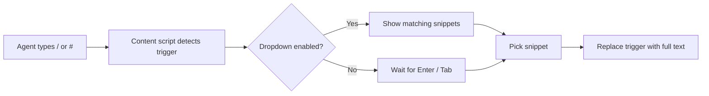

# Development

Technical reference for contributors working on Agent Assist.

---

## Tech stack

| Layer | Tools |
|-------|-------|
| Extension framework | [WXT](https://wxt.dev) — cross-browser MV3/MV2 builds |
| UI | React 19, TypeScript |
| Styling | Tailwind CSS 4, Radix UI |
| Forms and validation | React Hook Form, Zod |
| Persistence | Chrome Storage API (local) |
| Icons | Lucide React |

---

## Project structure

```
agent-assist/
├── entrypoints/          # WXT entry points (background, content, dashboard)
├── components/           # React UI (sidebar, forms, layout)
├── lib/                  # Core logic (insert-text, dropdown, storage, i18n)
├── shared/               # Schemas, constants, types
├── hooks/                # React hooks
├── assets/               # Global styles, logo
├── public/               # Icons and favicons
├── examples/             # Sample import JSON + Excel (run generate-examples.mjs)
└── screenshots/          # README previews
```

---

## Architecture



1. **Dashboard** — React app for managing categories, shortcuts, and settings. Data is stored locally via the extension storage API.
2. **Content script** — Runs on every page and listens for input in eligible text fields.
3. **Trigger detection** — When the user types `/` or `#` followed by a shortcut name, the extension matches against the stored library.
4. **Insertion** — The user picks from the dropdown or presses Enter/Tab on an exact match; the trigger text is replaced with the full snippet content.

Key modules:

- `lib/insert-text/` — DOM insertion for textarea and contenteditable targets
- `lib/dropdown-ui/` — In-page suggestion menu positioning and rendering
- `lib/content-script/` — Trigger binding and session state on web pages
- `lib/storage.ts` — Read/write extension settings and snippet data
- `shared/schemas.ts` — Zod schemas for import/export validation

---

## Scripts

| Command | Description |
|---------|-------------|
| `pnpm dev` | Dev build for Chrome (`.output/chrome-mv3-dev`) |
| `pnpm dev:firefox` | Dev build for Firefox (`.output/firefox-mv2-dev`) |
| `pnpm build` | Production Chrome build → `.output/chrome-mv3` |
| `pnpm build:firefox` | Production Firefox build → `.output/firefox-mv2` |
| `pnpm zip` | Packaged `.zip` for Chrome store submission |
| `pnpm zip:firefox` | Packaged `.zip` for Firefox store submission |
| `pnpm compile` | TypeScript type-check (`tsc --noEmit`) |

---

## Production builds

```bash
pnpm build          # Chrome MV3 → .output/chrome-mv3
pnpm build:firefox  # Firefox MV2 → .output/firefox-mv2
pnpm zip            # Packaged .zip for store submission
```

Load unpacked from the `.output/*` directories the same way as dev builds, or submit the zip artifacts to the browser stores.

---

## i18n

User-facing strings live in `lib/i18n/messages/`. Add or update locale files there when changing copy. Supported locales: `en-US`, `en-GB`, `fa`, `ar`, `tr`, `ku`.

---

## Testing changes

1. Run `pnpm dev` (or `pnpm dev:firefox`).
2. Load the unpacked extension from the matching `.output` folder.
3. Open the dashboard and verify CRUD, import/export, and theme/locale toggles.
4. Test in-page triggers on both a plain `<textarea>` and a `contenteditable` field.
5. Run `pnpm compile` before opening a pull request.

See [README.md](README.md#contributing) for contribution guidelines.
