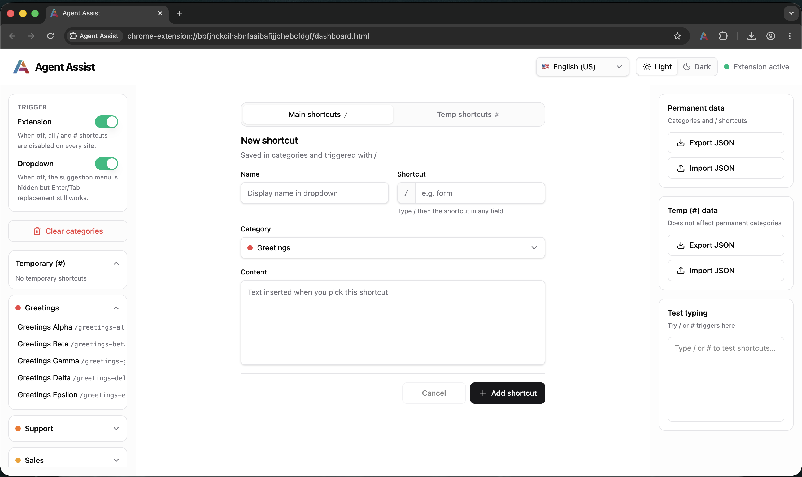
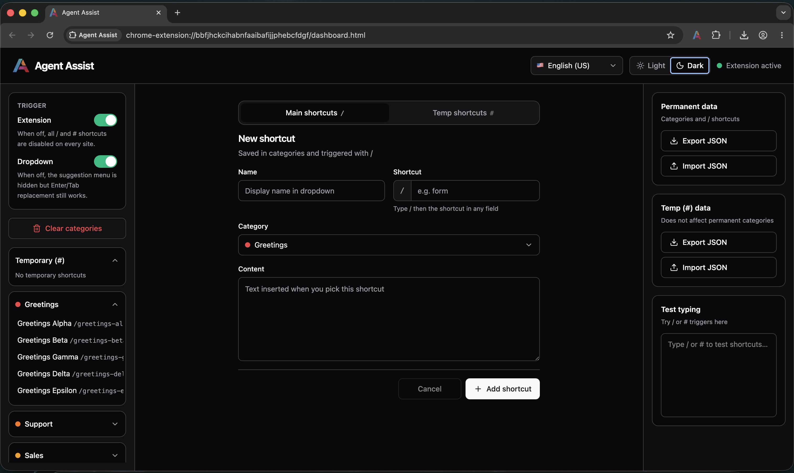
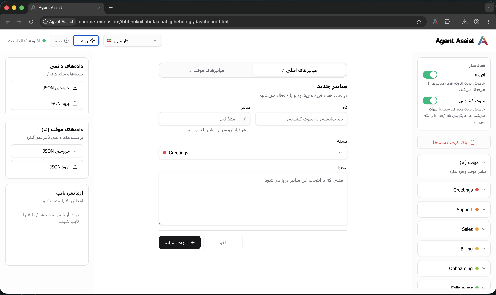
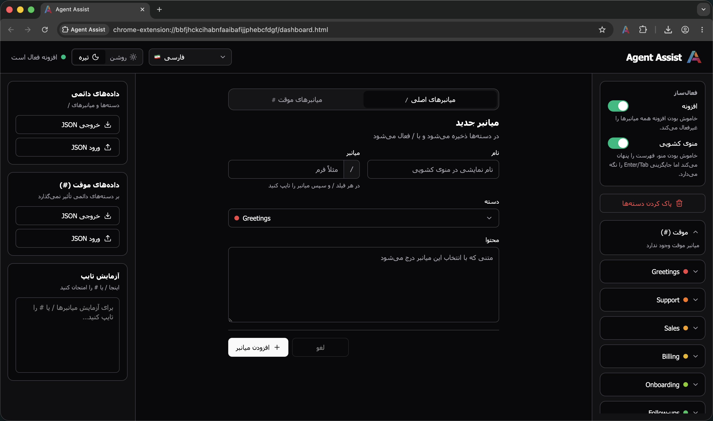
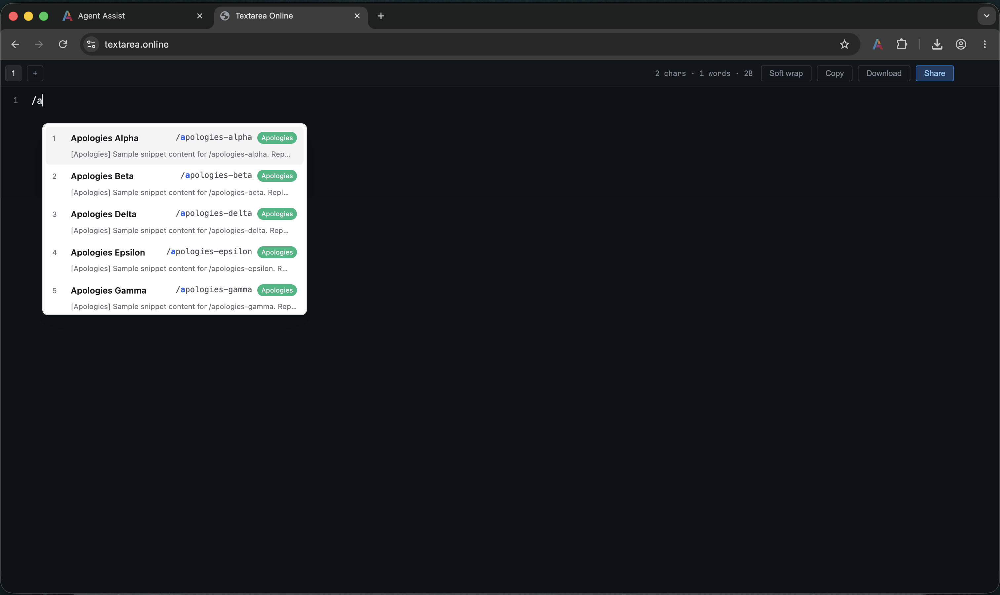
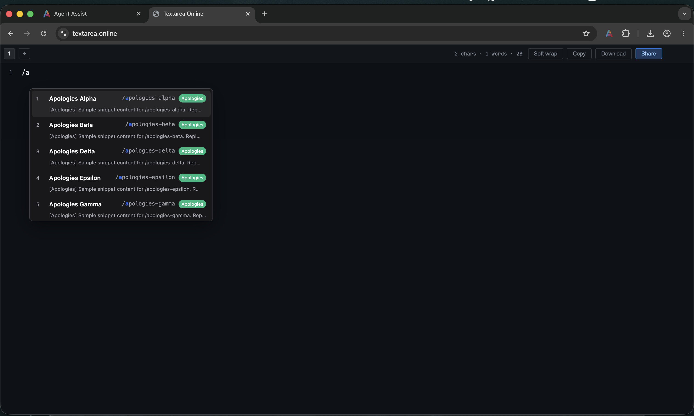

<p align="center">
  
</p>

<h1 align="center">Agent Assist</h1>

<p align="center">
  <strong>Text shortcuts for support agents — anywhere you type.</strong><br />
  Type <code>/</code> for permanent snippets or <code>#</code> for quick temp replies in any textarea or rich-text field across the web.
</p>

<p align="center">
  <a href="LICENSE"></a>
  
  
</p>

<p>
  
</p>

<p>
  
</p>

<p>
  
</p>

<p>
  
</p>

<p>
  
</p>

<p>
  
</p>

---

## What it does

Customer support, sales, and operations teams repeat the same messages all day — greetings, apologies, refund policies, escalation scripts. Copy-pasting from docs is slow. Switching tabs breaks flow.

**Agent Assist** brings your snippet library into every text field on the web. Create categorized shortcuts once, then expand them inline with a simple trigger. No context switching, no clipboard gymnastics.

---

## Features

### Expand snippets anywhere

Works in `<textarea>` and `contenteditable` fields on any website — helpdesk tools, CRMs, chat widgets, email composers, and more.

### Two trigger types for two workflows

| Trigger | Kind | Best for |
|---------|------|----------|
| `/name` | **Permanent** | Team-approved replies in categories — greetings, policies, closings |
| `#name` | **Temporary** | One-off or session snippets that stay out of your main library |

### Smart inline menu

Start typing after `/` or `#` and a fuzzy-search dropdown appears with matching snippets. Navigate with arrow keys, confirm with Enter or Tab. Turn the menu off and keep keyboard-only replacement when you prefer.

### Organized snippet library

Group permanent shortcuts into color-coded categories. Browse and edit from accordion sidebars, clear categories in bulk, and switch between permanent and temp libraries without clutter.

### Backup and share

Export permanent and temp data as separate JSON files. Import libraries from teammates, restore backups, or ship starter packs to new agents. Sample files live in [`examples/`](examples/).

### Built-in test panel

Try `/` and `#` triggers directly in the dashboard textarea before using them on live tickets.

### Control when it runs

Toggle all triggers globally from the sidebar — the toolbar icon turns green when active and shows an **OFF** badge when disabled. Dropdown suggestions can be toggled independently from snippet replacement.

### Themes and languages

Light and dark UI themes. Full interface localization in English (US/GB), Persian, Arabic, Turkish, and Kurdish — including RTL layout where needed.

### Cross-browser support

Chrome, Edge, Brave, and Opera (MV3), plus Firefox (MV2).

---

## Usage

1. Click the extension icon to open the **dashboard**.
2. Toggle **Trigger** in the left sidebar to enable or disable in-page shortcuts.
3. Create **categories**, then add **permanent** (`/`) or **temp** (`#`) shortcuts in the center form.
4. Browse and edit shortcuts from the left sidebar accordions.
5. **Export** or **import** JSON from the right panel to back up or share libraries.
6. Test triggers in the built-in textarea on the right.

Sample import files:

- [`agent-assist-permanent.json`](examples/agent-assist-permanent.json) — categories + `/` shortcuts
- [`agent-assist-temp.json`](examples/agent-assist-temp.json) — `#` shortcuts only

### Toolbar icon

| Icon | Meaning |
|------|---------|
| Green | Extension active — triggers work on all sites |
| Red with `OFF` badge | Extension disabled — no triggers fire |

---

## Installation

### Prerequisites

- [Node.js](https://nodejs.org/) 18+
- [pnpm](https://pnpm.io/) (recommended) or npm

### Install and run locally

```bash
pnpm install
pnpm dev          # Chrome — loads from .output/chrome-mv3-dev
pnpm dev:firefox  # Firefox — loads from .output/firefox-mv2-dev
```

### Load the extension

**Chrome / Edge / Brave / Opera**

1. Open `chrome://extensions`
2. Enable **Developer mode**
3. Click **Load unpacked** → select `.output/chrome-mv3-dev`

**Firefox**

1. Open `about:debugging#/runtime/this-firefox`
2. Click **Load Temporary Add-on** → select `manifest.json` inside `.output/firefox-mv2-dev`

For production builds, project structure, and architecture details, see [DEVELOPMENT.md](DEVELOPMENT.md).

---

## Contributing

Contributions are welcome — whether it's a bug fix, a new locale, UI polish, or documentation.

### Getting started

1. **Fork** the repository and create a branch from `main`.
2. **Install** dependencies with `pnpm install`.
3. **Run** `pnpm dev` and load the unpacked extension to test your changes.
4. **Type-check** with `pnpm compile` before opening a PR.

### Guidelines

- Keep changes focused — one feature or fix per pull request.
- Match existing code style and conventions in the file you're editing.
- Update translations in `lib/i18n/messages/` if you add or change user-facing strings.
- Test in both a `<textarea>` and a `contenteditable` field when touching insert or trigger logic.
- Do not commit secrets, API keys, or personal snippet data.

### Reporting issues

Open a GitHub issue with:

- Browser and version
- Steps to reproduce
- Expected vs. actual behavior
- Screenshots or screen recordings when helpful

---

## Team and contact

### Product owner

**Hassan Faraji**

[](mailto:mrmentor.cx@gmail.com)
[](https://www.linkedin.com/in/hassan-faraji-b975b2aa/)


### Developer

**Mohammad Mohagheghian**

[](mailto:vito.mohagheghian@gmail.com)
[](https://www.linkedin.com/in/mohammad-mohagheghian/)
[](https://mghn.info)


---

## License

[MIT](LICENSE) © 2026 Mohammad & Hassan 


